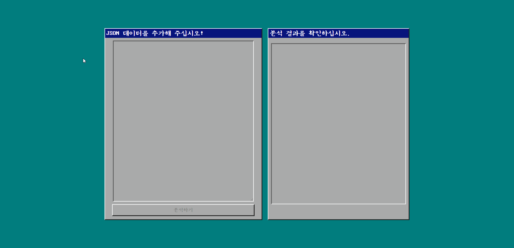
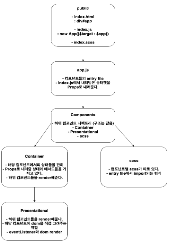
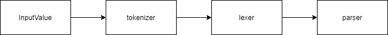

# fe-w8-json-parser

## Swing & Adela

## 결과물



## 구조

1. Frontend

```
/src
    - /components
    - /public
    - /utils
```

- components: 뷰를 담당하는 곳

  - input : 데이터 입력 section 담당, 입력된 데이터를 파싱한 결과물을 모델의 notify로 넘겨줌
  - json-parser : 입력된 데이터를 파싱하는 tokenize, lexicalize, parse의 과정을 담당
  - observable : notify로 넘겨주기 위한 모델
  - output : 데이터 출력 section 담당, 모델을 subscribe하며 notify로 받은 인자를 결과물 출력 section에서 보여줌

- 컴포넌트 구조

  

- JSON-Parser 구조

  

2. backend

- express.js

```
server.js
```

- webpack-dev-middleware를 사용하여 웹팩에서 번들링된 파일을 express 서버에서 받아 켜는 방식으로 구현

## JSON-Parser 로직

### 시나리오

1. 사용자는 JSON 데이터를 JSON 데이터 입력 창에 입력한다.
2. 사용자가 분석하기 버튼을 클릭한다.
3. 시스템은 사용자가 입력한 JSON 데이터를 tokenize, lexicalize, parse의 과정을 거쳐 파싱한다.
4. 시스템은 파싱된 결과물을 결과물 출력창에 출력한다.

### 함수 합성

```js
const go = (arg, ...fns) => fns.reduce((acc, fn) => fn(acc), arg);
```

- 합성된 함수를 반환하는 기존 pipe 함수와 달리 처음부터 arg를 받아 결과값을 반환하는 함수

```js
const result = go(inputValue, tokenize, lexicalize, parse);
// inputValue : 사용자가 입력한 JSON 데이터
```

### 함수 로직

참고 : [JSON-Parser](https://docs.google.com/presentation/d/1_tXFf3YjbWmUgmKwLNNrZCAW4iFoNe_QkW8zDcnghgQ/edit?usp=sharing)
